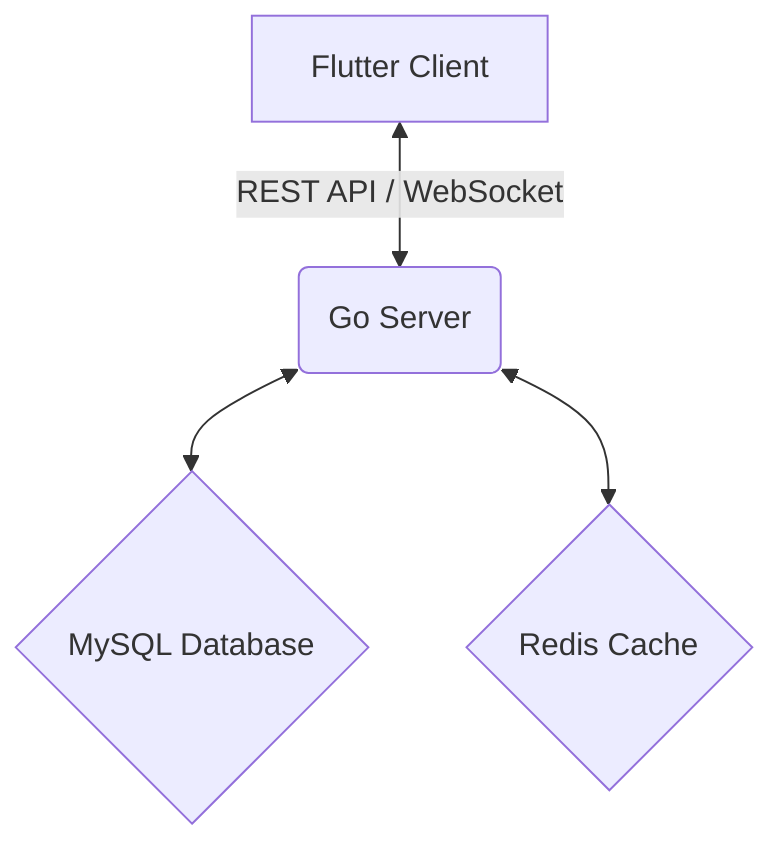

# Operation Won Client Documentation

This document provides a comprehensive overview of the Operation Won client application, including its architecture, data flow, and UI components.

## System Architecture

The Operation Won system consists of the following components:

- **Flutter Client**: A cross-platform mobile application that serves as the user interface for interacting with the system.
- **Go Server**: A backend server that handles business logic, data processing, and communication with the database and cache.
- **MySQL Database**: A relational database used for persistent data storage.
- **Redis Cache**: An in-memory data store used for caching frequently accessed data and managing real-time updates.

## Data Flow Diagram

The following diagram illustrates the high-level data flow between the system components:

## Client-Server Communication

The client and server communicate through two primary channels:

- **REST API**: Used for standard CRUD operations, such as fetching initial data, creating new entries, and updating existing records.
- **WebSocket**: Used for real-time communication, enabling the server to push live updates to the client without requiring the client to poll for changes.

## Real-time Event Flow

Real-time events are handled as follows:

1. The client establishes a WebSocket connection with the Go server.
2. When an event occurs (e.g., a new message is posted), the server publishes the event to a Redis pub/sub channel.
3. The server's WebSocket handler, subscribed to the Redis channel, receives the event and forwards it to the connected clients.
4. The client receives the event and updates the UI accordingly.

## Authentication Flow

User authentication is managed through JWT (JSON Web Tokens):

1. The user logs in with their credentials via a REST API endpoint.
2. The server validates the credentials and, if successful, generates a JWT.
3. The JWT is sent back to the client and stored securely.
4. For subsequent requests, the client includes the JWT in the authorization header, allowing the server to verify the user's identity.

This architecture ensures a secure and efficient system, with clear separation of concerns and scalable real-time capabilities.
